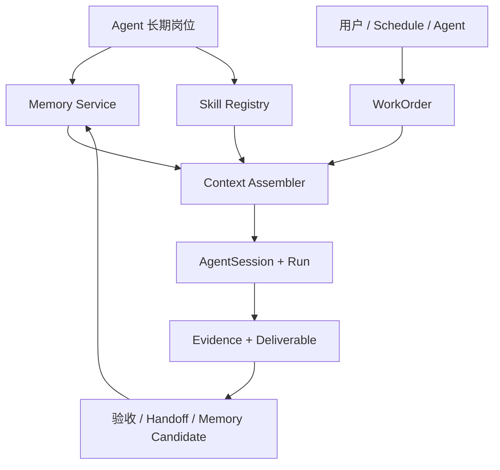
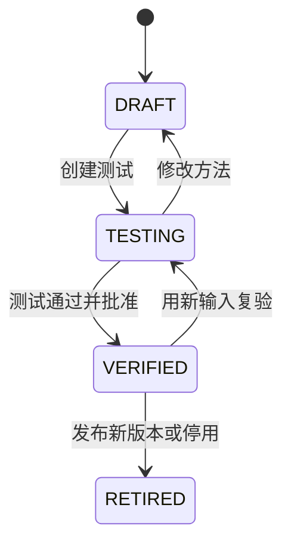

# 长期岗位、分层记忆、Skill、WorkOrder 与定时任务实现设计

> 文档状态：Draft for Implementation  
> 适用项目：Agent Teams  
> 实施顺序：阶段 A「长期岗位模型 + 分层记忆 + Skill」→ 阶段 B「WorkOrder + 定时任务」

## 1. 目标与边界

本次演进的目标不是把 Agent Teams 改造成普通聊天机器人，也不是简单增加一个 Cron 表，而是让现有 Agent 从“在某次 Change 中执行任务的静态角色”升级为“长期负责一类结果、能积累经过审核的经验、能复用稳定工作方法、能周期性交付的数字员工”。同时必须保留现有系统最有价值的能力：真实 CLI Runtime、Session Resume、并发队列、Workspace 权限硬校验、Git Worktree、Handoff、Evidence、Blocking Issue 和 Human Gate。

完成后，系统应支持以下最小闭环：用户创建“AI 情报研究员”，配置长期结果、来源、交付物、禁止动作和审批点；研究员完成一次真实 WorkOrder；用户纠正结果并将稳定方法发布为 Skill；系统在下一个 WorkOrder 中使用新 Session，但自动注入已批准的岗位记忆与指定 Skill；用户创建工作日 08:10 的计划；后台按时生成 WorkOrder、避免重复执行，失败时保留证据并通知用户。

本期不包含托管云电脑、跨设备云同步、完整插件市场、企业级 RBAC、任意第三方脚本自动执行和向量数据库集群。V1 以本地优先为原则：桌面应用关闭窗口后可驻留后台继续调度；显式退出应用、电脑关机或睡眠期间不保证实时执行，但恢复后按照 Misfire Policy 补偿。需要电脑离线仍持续执行时，再增加 Cloud Executor。

## 2. 设计原则

1. **岗位、方法、工作单、执行会话分离。** AgentProfile 描述长期责任；Memory 保存经过治理的经验；Skill 描述可复用方法；WorkOrder 描述一次交付；AgentSession 只服务于某个执行范围。
2. **长期记忆不等于永久 Session。** 每个 WorkOrder 创建独立 Session，同一 WorkOrder 内可以 Native Resume；跨 WorkOrder 通过检索后的结构化记忆续接，避免上下文膨胀和任务污染。
3. **记忆必须有来源、状态和生命周期。** 模型生成的内容先进入 Candidate，不能直接成为长期事实；高影响规则需要人工批准。
4. **Skill 不授予权限。** Skill 只能声明所需能力，实际权限始终取 Agent 默认权限、Workspace Binding、WorkOrder Policy 和当前审批状态的交集。
5. **Schedule 只负责产生 WorkOrder。** Schedule 不直接启动任意命令，不承载复杂业务状态；执行、重试、证据和验收统一进入 WorkOrder。
6. **没有证据就没有成功。** WorkOrder 的成功必须满足 Output Contract 和 Required Evidence；Runtime Exit 0 只代表进程结束，不代表业务结果合格。
7. **保持现有 Change 链路稳定。** 新模型采用增量扩展；研发 Change 继续使用现有 Workflow，不把所有 Change 强行迁移为 WorkOrder，也不使用“隐藏 Change”模拟通用工作。

## 3. 目标架构



运行时新增四个核心服务：`MemoryService` 负责记忆候选、审批、检索、冲突和失效；`SkillService` 负责 Skill 版本、测试、发布和绑定；`WorkOrderService` 负责一次工作从创建到验收的状态机；`ScheduleService` 负责到期扫描、租约、幂等创建和错过执行补偿。现有 `AdapterRegistry`、`RuntimeQueue`、`EvidenceService` 和底层进程管理继续复用，`TeamRunManager` 抽取通用 `ExecutionManager`，同时接受 Change Task 和 WorkOrder 两类执行主体。

## 4. 阶段 A：长期岗位模型

### 4.1 为什么不直接把字段继续堆进 t_agent

`t_agent` 当前承担 Runtime 执行身份，字段较稳定。岗位规则、来源和审批点会频繁演进，也需要独立版本和审计。建议保留 `Agent` 作为执行身份，新增一对一 `AgentProfile`，避免破坏现有 Agent 创建、Change Binding 和默认四 Agent 数据。

### 4.2 AgentProfile 数据模型

```ts
type AgentProfileStatus = 'DRAFT' | 'ACTIVE' | 'PAUSED' | 'ARCHIVED'

interface AgentProfile {
  id: string
  agentId: string
  positionTitle: string
  outcomeStatement: string
  recurringResponsibilities: string[]
  preferredSources: string[]
  standardDeliverables: string[]
  acceptanceCriteria: string[]
  prohibitedActions: string[]
  approvalPoints: string[]
  failurePolicy: string
  defaultSkillIds: string[]
  status: AgentProfileStatus
  version: number
  createdAt: string
  updatedAt: string
}
```

岗位配置对应用户真正需要回答的八个问题：长期负责什么结果、从哪里获取信息、通常怎么工作、固定交付什么、怎样算合格、禁止做什么、何时找人批准、失败后怎样处理。原 `Agent.responsibility` 和 `qualityBar` 保留，用作 Runtime Prompt 的短摘要；启用 AgentProfile 后由系统生成摘要，防止两套配置长期漂移。

### 4.3 数据表

```sql
CREATE TABLE t_agent_profile (
  id TEXT PRIMARY KEY,
  agent_id TEXT NOT NULL UNIQUE,
  position_title TEXT NOT NULL,
  outcome_statement TEXT NOT NULL,
  recurring_responsibilities TEXT NOT NULL,
  preferred_sources TEXT NOT NULL,
  standard_deliverables TEXT NOT NULL,
  acceptance_criteria TEXT NOT NULL,
  prohibited_actions TEXT NOT NULL,
  approval_points TEXT NOT NULL,
  failure_policy TEXT NOT NULL,
  default_skill_ids TEXT NOT NULL,
  status TEXT NOT NULL,
  version INTEGER NOT NULL,
  created_at TEXT NOT NULL,
  updated_at TEXT NOT NULL,
  FOREIGN KEY(agent_id) REFERENCES t_agent(id)
);
```

迁移时为已有 Agent 自动创建 Profile：`positionTitle=description`、`outcomeStatement=responsibility`、`acceptanceCriteria=qualityBar`，其余字段使用空数组，状态为 `DRAFT`。用户第一次打开岗位详情时提示补全，不阻塞原有 Change 执行。

## 5. 阶段 A：分层记忆

### 5.1 记忆层次

| 层次 | 作用域 | 示例 | 默认保留策略 |
|---|---|---|---|
| Role Memory | Agent | 用户要求所有情报必须标注来源时间；不得猜测曝光量 | 长期，规则变更时产生新版本 |
| Project Memory | Agent + Workspace/Project | 项目使用 Java 17；退款链路依赖 TravelSky | 项目有效期内保留，可设置过期时间 |
| Episode Memory | Agent + WorkOrder | 2026-09-04 Grok Bot 调研的目标、结果、失败和反馈 | 保存摘要，原始 Evidence 可回溯 |
| Workflow Memory | Team/Workflow | 库存异常先交给内容专员，再交运营主管汇总 | 经验证后长期保留 |

共享记忆不是一个无限增长的 Markdown 文本，而是一组可检索、可审批、可失效、可追溯的 MemoryEntry。

### 5.2 MemoryEntry 数据模型

```ts
type MemoryScope = 'ROLE' | 'PROJECT' | 'EPISODE' | 'WORKFLOW'
type MemoryKind = 'RULE' | 'PREFERENCE' | 'FACT' | 'SOURCE' | 'DECISION' | 'LESSON' | 'FAILURE'
type MemoryStatus = 'CANDIDATE' | 'ACTIVE' | 'REJECTED' | 'SUPERSEDED' | 'EXPIRED'

interface MemoryEntry {
  id: string
  agentId: string | null
  scope: MemoryScope
  scopeId: string
  kind: MemoryKind
  title: string
  content: string
  tags: string[]
  confidence: number
  status: MemoryStatus
  sourceType: 'HUMAN' | 'RUN' | 'EVIDENCE' | 'HANDOFF' | 'IMPORT'
  sourceId: string
  supersedesId: string | null
  expiresAt: string | null
  approvedBy: string | null
  approvedAt: string | null
  createdAt: string
  updatedAt: string
}
```

数据库新增 `t_memory_entry`，并建立 `(agent_id, scope, scope_id, status)`、`(status, updated_at)`、`(source_type, source_id)` 索引。V1 使用 SQLite FTS5 对 title、content、tags 建全文索引；当单机记忆超过约一万条或语义召回明显不足时，再引入可选向量索引，不把向量数据库作为首版前置依赖。

### 5.3 记忆写入规则

1. 用户明确点击“记住这条规则”时，创建 `sourceType=HUMAN` 的 Candidate，可在确认弹窗中直接激活。
2. HumanIntervention、WorkOrder 返工意见和对结果的纠正自动生成 Candidate，但默认不激活。
3. 已验收 WorkOrder 自动生成 Episode Summary；它可以直接进入 ACTIVE，但只能作为历史经验，不能自动提升为 RULE。
4. 模型提出的长期规则、来源偏好和流程改进必须进入“记忆待确认”列表。
5. 新记忆与现有 ACTIVE 记忆矛盾时不得静默覆盖；标记 Conflict，让用户选择保留旧规则、启用新规则或限定作用域。
6. 所有记忆都能追溯到 Run、Evidence、Handoff 或人工输入；删除采用状态变更和审计事件，不做无记录硬删除。

### 5.4 上下文组装

每次启动 WorkOrder 时，`ContextAssembler` 按以下顺序生成 Prompt Context：

```text
岗位身份与长期结果
→ 必须遵守的 ACTIVE Role Rules
→ 当前 Project Facts / Decisions
→ 本次指定 Skill 及版本
→ 与目标、标签、来源最相关的 Episode / Workflow Memory
→ 当前 WorkOrder 目标、输入、约束、交付格式和审批点
→ 同一 WorkOrder 已有 Session Summary / Handoff
```

检索先执行确定性过滤：Agent、Scope、Project、状态、有效期、标签；再执行 FTS 相关度排序。规则类记忆优先级高于经验类记忆，人工来源高于模型来源，新版本高于被替代版本。ContextAssembler 必须保存本次实际注入的 Memory ID 和 SkillVersion ID，形成 `CONTEXT` Evidence，保证结果可复现。

这里需要设置“单次上下文装配预算”，但它只是模型上下文窗口的内部技术预算，不是用户可见的聊天总 Token 限制，也不会因为累计 Token 达到某个值而停止 WorkOrder。超出预算时先压缩 Episode，再减少低相关记忆，强制规则和人工批准内容不得被静默截断。

### 5.5 Session 策略

每个 WorkOrder、Agent、Workspace 组合建立一个 AgentSession；同一 WorkOrder 的继续、重试和人工纠偏优先 Native Resume。新 WorkOrder 建立新 Session，由 ContextAssembler 注入长期记忆，不直接 Resume 上一张工作单。这样既能保留岗位连续性，又能隔离不同任务。

现有 `t_agent_session` 以 `change_id` 非空为前提，需要迁移为执行主体模型：

```ts
type ExecutionSubject =
  | { type: 'CHANGE'; changeId: string }
  | { type: 'WORK_ORDER'; workOrderId: string }
```

建议重建 `t_agent_session_v2`，增加 `subject_type` 和 `subject_id`，将 `workspace_id` 改为可空；已有记录全部迁移为 `subject_type='CHANGE'`、`subject_id=change_id`。建立唯一索引 `(agent_id, subject_type, subject_id, IFNULL(workspace_id,''))`。Conversation Participant 现有独立 Session 机制本期不迁移，降低变更范围。

## 6. 阶段 A：Skill

### 6.1 Skill 定位

Skill 是经过验证、可版本化、可绑定岗位的工作方法，不是一次性 Prompt，也不是可以绕过权限执行任意命令的插件。V1 Skill 由 Markdown Instructions、输入输出 Schema、能力声明、验证用例和失败策略组成；脚本、二进制和动态依赖执行留到后续安全沙箱阶段。

### 6.2 数据模型

```ts
interface Skill {
  id: string
  name: string
  description: string
  trigger: string
  ownerAgentId: string | null
  status: 'DRAFT' | 'ACTIVE' | 'ARCHIVED'
  activeVersionId: string | null
  createdAt: string
  updatedAt: string
}

interface SkillVersion {
  id: string
  skillId: string
  version: number
  instructionsPath: string
  inputSchema: Record<string, unknown>
  outputSchema: Record<string, unknown>
  requiredCapabilities: string[]
  requiredEvidence: string[]
  approvalPoints: string[]
  failurePolicy: string
  checksum: string
  status: 'DRAFT' | 'TESTING' | 'VERIFIED' | 'RETIRED'
  createdFromRunId: string | null
  createdAt: string
  verifiedAt: string | null
}
```

SQLite 保存 Skill 元数据、版本、绑定和测试记录；正文与示例保存在 `userData/skills/{skillId}/{version}/SKILL.md`。每次发布计算 SHA-256 Checksum，已 VERIFIED 的版本不可原地修改，只能创建新版本。新增表：`t_skill`、`t_skill_version`、`t_agent_skill`、`t_skill_test_case`、`t_skill_test_run`。

### 6.3 Skill 生命周期



Skill 发布至少满足：触发条件明确；输入字段可校验；步骤顺序完整；输出 Schema 可验证；缺失数据和失败处理明确；所需权限已声明；外部副作用列出审批点；至少一个不同于原任务的测试用例通过。Skill Test 使用真实 Runtime，但只能在测试 Workspace 或只读数据源执行，产生独立 Evidence。

### 6.4 从真实任务提炼 Skill

WorkOrder 验收后提供“沉淀为 Skill”入口。系统根据任务、实际 Context、Run 结果、Evidence、人工纠正生成 Skill Draft；用户审查后创建测试用例；测试通过再发布。不能让模型在一次执行后自动把方法设为 ACTIVE。后续 WorkOrder 必须记录使用的 SkillVersion，Skill 升级不会改变正在运行的 WorkOrder。

### 6.5 权限计算

```text
Effective Permission
= Agent 默认权限
∩ Workspace Binding 权限
∩ WorkOrder Policy 允许范围
∩ 当前阶段/审批状态允许范围
```

`requiredCapabilities` 只用于执行前检查。如果 Skill 需要网络或写文件，而有效权限不满足，WorkOrder 进入 BLOCKED 并给出缺失能力，禁止自动放宽。发送消息、发布内容、付款、删除、生产变更等即使底层 Runtime 具备能力，也必须先创建 ApprovalRequest。

## 7. 阶段 B：WorkOrder

### 7.1 为什么需要独立 WorkOrder

Change 天然面向软件变更，要求 Workspace、Workflow、Git 和阶段 Evidence。情报搜集、经营晨报、文档整理等工作不应该伪装成隐藏 Change。WorkOrder 是数字员工的一次工作单，可以由人、Schedule 或另一个 Agent 创建；需要修改代码时，WorkOrder 可以显式转换或关联一个 Change。

### 7.2 数据模型

```ts
type WorkOrderStatus =
  | 'DRAFT' | 'READY' | 'QUEUED' | 'RUNNING'
  | 'WAITING_APPROVAL' | 'BLOCKED' | 'VERIFYING'
  | 'SUCCEEDED' | 'FAILED' | 'CANCELLED'

interface WorkOrder {
  id: string
  number: number
  title: string
  goal: string
  ownerAgentId: string
  createdByType: 'HUMAN' | 'SCHEDULE' | 'AGENT'
  createdById: string | null
  scheduleId: string | null
  parentWorkOrderId: string | null
  projectScopeId: string | null
  workspaceId: string | null
  skillVersionIds: string[]
  input: Record<string, unknown>
  constraints: string[]
  outputContract: Record<string, unknown>
  requiredEvidence: string[]
  approvalPolicyId: string | null
  status: WorkOrderStatus
  idempotencyKey: string
  dueAt: string | null
  startedAt: string | null
  completedAt: string | null
  createdAt: string
  updatedAt: string
}
```

同时增加 `WorkOrderRun` 或扩展现有 Run。推荐扩展现有 `t_run` 为通用执行记录：`change_id` 可空，新增 `work_order_id`，通过 CHECK 保证二者恰好一个非空；`Message`、`Evidence` 和 `Handoff` 增加 Subject Type/ID。不要复制第二套进程、Usage、Evidence 和 Adapter 实现。

### 7.3 状态机

```text
DRAFT → READY → QUEUED → RUNNING → VERIFYING → SUCCEEDED
                         │          ├→ BLOCKED → QUEUED
                         │          └→ WAITING_APPROVAL → QUEUED
                         ├→ FAILED → QUEUED（按 Retry Policy）
                         └→ CANCELLED
```

状态含义：READY 表示输入、负责人和 Skill 校验完成；QUEUED 表示已经进入全局 RuntimeQueue；RUNNING 表示真实 Runtime 已启动；VERIFYING 检查 Output Contract 和 Evidence；WAITING_APPROVAL 表示下一动作存在外部后果；BLOCKED 表示缺数据、缺权限、连接器失效或需要人工决策；SUCCEEDED 必须通过验收，不能仅依赖 Exit 0。

### 7.4 WorkOrder 执行流程

1. 校验 AgentProfile 是否 ACTIVE、输入是否满足 Skill Input Schema、依赖数据是否可用。
2. 计算有效权限；不满足时进入 BLOCKED，不启动 Runtime。
3. ContextAssembler 选择岗位规则、项目事实、相关 Episode、指定 Skill 和当前输入，并保存 Context Evidence。
4. 为 WorkOrder 创建独立 AgentSession 和 Run，进入现有 RuntimeQueue。
5. Adapter 启动真实 CLI；运行时输出、Usage、文件和外部来源生成 Evidence。
6. OutputValidator 校验输出 Schema、来源时间、完整性和 Required Evidence。
7. 有外部副作用时创建 ApprovalRequest；批准后启动新的 Parent Run 执行动作，拒绝则保留草稿并结束或返工。
8. 验收成功后保存 Deliverable、Episode Memory；可选生成 Skill/Rule Candidate。
9. 需要其他 Agent 时创建子 WorkOrder 和 Handoff，接收方显式 ACCEPT/REJECT，避免只有“发出交接”而没有接收状态。

### 7.5 通用 Evidence

在现有 `COMMAND/RUNTIME/GIT/DIFF/TEST/USAGE` 基础上增加：`SOURCE`（URL、读取时间、内容摘要和哈希）、`DATA_FRESHNESS`（数据时间与覆盖范围）、`OUTPUT_SCHEMA`（交付结构校验）、`DELIVERY`（文件或消息是否成功送达）、`APPROVAL`（批准人、范围和时间）。非研发 WorkOrder 不强制 Git Evidence，但必须按工作类型配置 Required Evidence。

## 8. 阶段 B：定时任务

### 8.1 Schedule 数据模型

```ts
interface Schedule {
  id: string
  name: string
  ownerAgentId: string
  workOrderTemplate: Record<string, unknown>
  cronExpression: string
  timezone: string
  enabled: boolean
  misfirePolicy: 'SKIP' | 'RUN_ONCE' | 'RUN_ALL_BOUNDED'
  concurrencyPolicy: 'SKIP' | 'QUEUE' | 'REPLACE'
  maxCatchUpRuns: number
  retryPolicy: { maxAttempts: number; backoffSeconds: number[] }
  nextRunAt: string
  lastScheduledAt: string | null
  leaseOwner: string | null
  leaseExpiresAt: string | null
  createdAt: string
  updatedAt: string
}

interface ScheduleExecution {
  id: string
  scheduleId: string
  scheduledFor: string
  workOrderId: string | null
  idempotencyKey: string
  status: 'CLAIMED' | 'CREATED' | 'SKIPPED' | 'FAILED'
  error: string | null
  createdAt: string
}
```

对 `(schedule_id, scheduled_for)` 和 `idempotency_key` 建唯一索引，保证应用重启、轮询重复或时钟变化不会产生重复 WorkOrder。数据库统一保存 UTC 时间，Schedule 保存 IANA 时区；下一次触发使用成熟 Cron 库计算，并增加夏令时测试。

### 8.2 调度算法

`ScheduleService` 每 15～30 秒扫描 `enabled=1 AND next_run_at<=now` 的记录。在 SQLite 事务中通过带条件 UPDATE 获取租约，只有一个 Runtime 实例能认领；随后创建 ScheduleExecution 和 WorkOrder，计算新的 nextRunAt，提交事务后再将 WorkOrder 放入队列。进程在认领后崩溃时，租约到期可被重新获取，唯一幂等键阻止重复创建。

Misfire Policy：`SKIP` 跳过错过时点并计算下一次；`RUN_ONCE` 无论错过多少次只补一张；`RUN_ALL_BOUNDED` 最多补 `maxCatchUpRuns` 张。Concurrency Policy：`SKIP` 在上一张未结束时记录跳过；`QUEUE` 正常排队；`REPLACE` 需要显式允许取消旧 WorkOrder，默认不开放给有外部副作用的任务。

### 8.3 后台运行边界

第一版采用“关闭窗口不退出应用”的后台模式：Main Window 隐藏后 Utility Runtime、ScheduleService 和 RuntimeQueue 继续工作，托盘显示正在运行和下一次计划；用户选择“退出 Agent Teams”时明确提示活动 WorkOrder 和 Schedule 将停止。系统启动时执行 Misfire 恢复。可以增加可选开机启动。

电脑睡眠、关机或应用被强制结束期间无法真实运行任务；恢复后根据策略补偿。后续 Cloud Executor 上线后，Schedule Claim 和 WorkOrder 状态放到云端，桌面端只负责查看与人工接管。文案必须清楚区分“后台驻留”与“云端持续运行”，不能让用户误认为关机后任务仍会执行。

## 9. 审批与交接补充

长期数字员工进入真实业务系统后，只有 Read/Write/Network 三个布尔权限不够。新增 `ApprovalPolicy` 和 `ApprovalRequest`：策略按 Capability、Connector、资源范围、动作和风险等级匹配；请求保存计划动作、目标、参数摘要、证据、有效期和批准范围。V1 至少支持 `SEND_MESSAGE`、`PUBLISH_CONTENT`、`DELETE_RESOURCE`、`PAYMENT`、`REFUND`、`CHANGE_PERMISSION`、`PRODUCTION_CHANGE`。

Handoff 增加 `subjectType/subjectId`、`status=CREATED|ACCEPTED|REJECTED|COMPLETED`、接收时间和拒绝原因。交接内容优先引用 Deliverable、Evidence 和 Memory，而不是把上一名 Agent 的完整 Session 全量塞给下一名 Agent。

## 10. Runtime API 与代码结构

### 10.1 新增 RuntimeRequest

```ts
type RuntimeRequest =
  | { type: 'agentProfile.get'; agentId: string }
  | { type: 'agentProfile.upsert'; input: UpsertAgentProfileInput }
  | { type: 'memory.list'; query: MemoryQuery }
  | { type: 'memory.approve'; memoryId: string }
  | { type: 'memory.reject'; memoryId: string }
  | { type: 'skill.createDraft'; input: CreateSkillInput }
  | { type: 'skill.test'; skillVersionId: string; testCaseId: string }
  | { type: 'skill.publish'; skillVersionId: string }
  | { type: 'workOrder.create'; input: CreateWorkOrderInput }
  | { type: 'workOrder.control'; id: string; action: 'start' | 'pause' | 'resume' | 'cancel' | 'retry' }
  | { type: 'schedule.create'; input: CreateScheduleInput }
  | { type: 'schedule.update'; input: UpdateScheduleInput }
  | { type: 'schedule.testRun'; scheduleId: string }
  | { type: 'approval.decide'; id: string; decision: 'APPROVE' | 'REJECT'; note?: string }
```

### 10.2 建议目录

```text
src/runtime/
├── memory/memory-service.ts
├── memory/context-assembler.ts
├── skills/skill-service.ts
├── skills/skill-validator.ts
├── work-orders/work-order-service.ts
├── work-orders/output-validator.ts
├── schedules/schedule-service.ts
├── schedules/schedule-calculator.ts
├── approvals/approval-service.ts
├── execution/execution-manager.ts
└── execution/execution-subject.ts

src/renderer/src/pages/
├── AgentProfile.tsx
├── MemoryInbox.tsx
├── Skills.tsx
├── SkillEditor.tsx
├── WorkOrders.tsx
├── WorkOrderRoom.tsx
└── Schedules.tsx
```

`AppSnapshot` 不应无限装入所有 Memory 和 WorkOrder 历史。保留当前 Snapshot 用于导航统计，详细列表改用分页查询；运行事件继续使用 IPC Push。大文本 Skill、Evidence 和 Deliverable 按 ID 延迟读取。

## 11. 页面与交互

Agent 详情改为五个页签：岗位、记忆、Skills、计划任务、工作历史。岗位页使用八段式配置；记忆页区分“正在生效”和“待确认”，支持查看来源、冲突、过期和替代关系；Skills 页展示绑定版本、最近测试和失败原因；计划任务页展示 Cron 的自然语言解释、时区、下次运行、并发策略和 Test Run；历史页按 WorkOrder 展示状态、交付物、Evidence、Token/成本和人工反馈。

新增“工作单”一级入口。创建 WorkOrder 时依次选择负责人、目标、输入/数据范围、Skill、交付格式、截止时间和审批策略；高级权限默认折叠。WorkOrderRoom 保留现有 TaskRoom 的运行日志和 Evidence，但突出业务交付、数据新鲜度和审批状态，不强制展示 Git 信息。

Schedule 创建后必须先安排一次 5～10 分钟后的 Test Run。正式启用前展示检查清单：负责人可用、Skill 已验证、连接/文件可读取、时区正确、输出位置明确、失败通知已设置、外部动作存在审批策略。

## 12. 实施计划

### 阶段 A1：岗位与记忆基础

- 扩展 Contracts、SQLite Migration、Repository 和 IPC。
- AgentProfile 创建/编辑/版本审计。
- MemoryEntry、FTS5、Candidate 审批、冲突与过期。
- ContextAssembler 和 CONTEXT Evidence。
- 将 HumanIntervention 与已验收 Run 转成 Memory Candidate/Episode。

完成标志：同一个 Agent 完成两张不同 WorkOrder/测试任务时使用不同 Session，但第二张能够正确引用第一张已批准的规则；未批准候选不得进入 Prompt。

### 阶段 A2：Skill

- Skill/Version/Binding/Test 数据模型和文件存储。
- Skill Draft、编辑、Schema 校验、Test Run、发布和回滚。
- 从已验收 Run 提炼 Skill Draft。
- ContextAssembler 注入固定 SkillVersion；ExecutionManager 校验能力但不授予权限。

完成标志：同一 Skill 使用第二份输入真实测试通过；修改后产生新版本；历史 WorkOrder 仍能定位原版本和 Checksum。

### 阶段 B1：WorkOrder

- 新增 WorkOrder、Deliverable、ApprovalRequest 状态机。
- 泛化 AgentSession/Run/Message/Handoff 的 ExecutionSubject。
- 复用 Adapter、RuntimeQueue、EvidenceService、Usage 和 Pause/Resume/Retry。
- 增加 SOURCE、DATA_FRESHNESS、OUTPUT_SCHEMA 和 DELIVERY Evidence。
- WorkOrder 页面、详情、人工纠正、转 Change 和 Agent 间交接。

完成标志：人工创建一张非 Git 情报工作单，真实运行、验收、返工、交接、生成 Episode Memory，并能追溯到 Session、Run、SkillVersion 和 Evidence。

### 阶段 B2：Schedule 与后台运行

- Schedule、ScheduleExecution、Cron/时区计算。
- 事务租约、幂等键、Misfire、Concurrency 和 Retry Policy。
- Test Run、启停、下次运行和执行历史页面。
- 关闭窗口驻留托盘、明确退出提示、开机启动和恢复补偿。

完成标志：跨应用重启不会重复执行；错过计划按策略补偿；同一 Schedule/时间点最多产生一张 WorkOrder；计划失败不会显示成功，且用户能看到原因和重试记录。

## 13. 验收标准

### 13.1 长期岗位与记忆

1. 已有 Agent 无损迁移，原 Change、Run、Session 和 Evidence 可正常读取。
2. AgentProfile 八类岗位信息可以保存、版本化并进入后续 Prompt。
3. 新 WorkOrder 不 Resume 旧 WorkOrder Session，但能检索并注入已批准的相关记忆。
4. Candidate、ACTIVE、SUPERSEDED、EXPIRED 状态行为正确；未批准规则不参与执行。
5. 每条长期记忆能追溯到人工输入、Run、Evidence 或 Handoff。
6. 冲突记忆必须请求处理，不得静默覆盖。
7. Context Evidence 精确记录实际使用的 Memory 和 SkillVersion。

### 13.2 Skill

1. Skill 具备触发条件、输入输出 Schema、步骤、权限声明、Evidence、失败策略和审批点。
2. Skill 必须通过至少一项不同输入的真实测试后才能发布。
3. VERIFIED 版本不可原地修改；升级、回滚和历史引用正确。
4. Skill 声明的能力不能放宽 Agent 或 Workspace 权限。
5. 缺权限、缺输入、输出不符合 Schema 时明确 BLOCKED/FAILED，不得伪造成功。

### 13.3 WorkOrder

1. 支持 HUMAN、SCHEDULE、AGENT 三种创建来源和唯一幂等键。
2. Run 必须关联 Change 或 WorkOrder 之一，不能同时为空或同时存在。
3. Exit 0 不能直接把 WorkOrder 标记为 SUCCEEDED；Required Evidence 和 Output Contract 必须通过。
4. Pause、Resume、Retry 保留 Parent Run 和原生 Session 续接关系。
5. Handoff 有接收状态；子 WorkOrder 能引用父级 Deliverable 与 Evidence。
6. 人工纠正产生 HumanIntervention 和 Memory Candidate，不直接污染长期规则。

### 13.4 Schedule

1. Cron、时区和夏令时计算有确定性测试。
2. 同一 `scheduleId + scheduledFor` 只能创建一次 ScheduleExecution 和 WorkOrder。
3. SKIP、RUN_ONCE、RUN_ALL_BOUNDED 三种 Misfire 策略行为符合定义。
4. SKIP、QUEUE、REPLACE 三种并发策略可测试；高风险任务默认禁止 REPLACE。
5. 应用重启、租约过期和重复扫描不会产生重复交付。
6. 关闭窗口后任务继续；显式退出、睡眠、关机边界有清楚提示。
7. 失败、部分完成、过期数据分别显示，不把部分结果标记为成功。

## 14. 测试策略

单元测试覆盖 Memory 排序和冲突、Skill Schema 和版本、WorkOrder 状态机、Cron/时区、Misfire、幂等和权限交集；数据库测试覆盖旧表迁移、约束、索引和崩溃恢复；集成测试使用 Fake Adapter 验证 Context → Run → Evidence → Memory Candidate 闭环；真实 E2E 至少覆盖 Claude、Codex 各一条 WorkOrder Resume，两个 Agent 的 Handoff，一条工作日定时任务，一次应用重启后的补偿，以及一项需要人工批准的外部动作。CI 不能仅检查页面渲染，必须验证数据库不重复、状态机不越级和 Evidence Gate 不被绕过。

## 15. 风险与取舍

最大的风险不是功能数量，而是把未经验证的模型输出写入长期记忆，导致错误被持续放大；因此 Memory Governance 必须先于自动学习。第二个风险是为了复用现有 Change 链路，把所有通用工作包装成隐藏 Change，最终使领域模型和页面语义混乱；应通过 ExecutionSubject 复用底层执行，而不是复用 Change 业务概念。第三个风险是把 Schedule 当作简单定时器，忽略时区、幂等、租约、错过执行和并发策略；无人值守任务的可靠性主要由这些失败路径决定。第四个风险是 Skill 变成权限后门；Skill 只声明能力，绝不授予能力。第五个风险是对“后台运行”做过度承诺；本地驻留、电脑睡眠和云端执行必须在产品文案和状态中严格区分。

## 16. 最终产品形态

完成这两阶段后，Agent Teams 将形成两条互补主线：研发任务继续使用 `Change → Workflow → Task → Evidence`，长期数字员工使用 `AgentProfile → Memory/Skill → WorkOrder → Schedule/Handoff`；两条主线在 Adapter、RuntimeQueue、AgentSession、Run、Evidence、权限和 Human Approval 层汇合。这样既不会丢掉当前在软件研发可信执行上的优势，也能逐步覆盖情报、内容、运营、分析等长期岗位场景。
